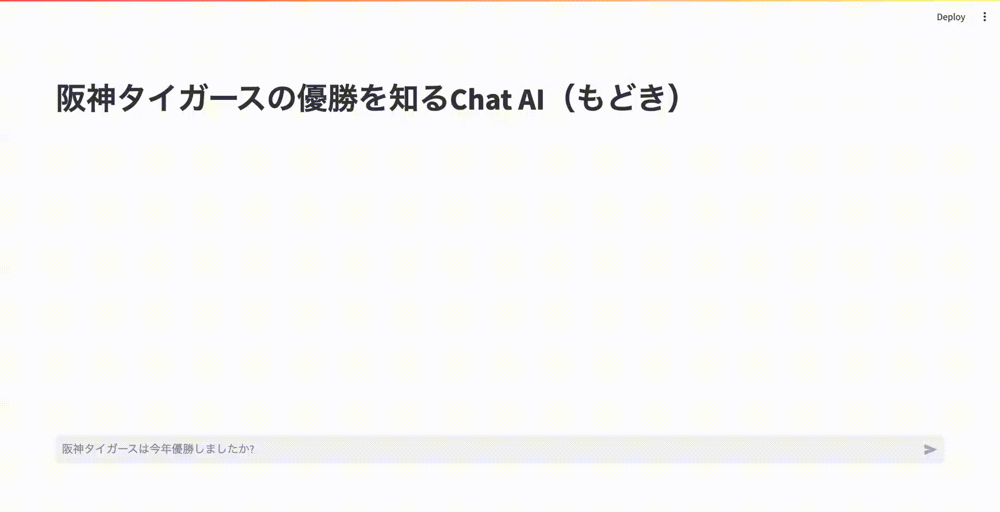

# Streamlit Chat App sample

Conversational apps for Streamlit :baseball:


## install

```bash
$ poetry install
```

## Run

### local

```bash
$ streamlit run app.py
```

### Docker

```bash
$ docker compose up
```

## Build & Deploy for Cloud Run

### Create Repository(1st time only)

```bash
$ gcloud artifacts repositories create sample-streamlit-chat \
    --repository-format=docker \
    --location=asia-northeast1 \
    --description="streamlit app sample" \
    --kms-key=KMS-KEY \
    --immutable-tags \
    --async
```

### Build & Deploy

```bash
$
```

## Use

Open to http://localhost:8501/

## Demo



## Reference

[Build conversational apps](https://docs.streamlit.io/knowledge-base/tutorials/build-conversational-apps)